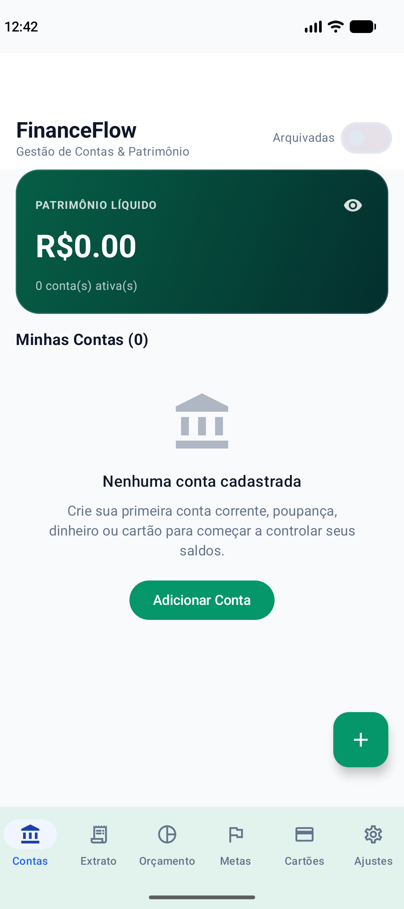
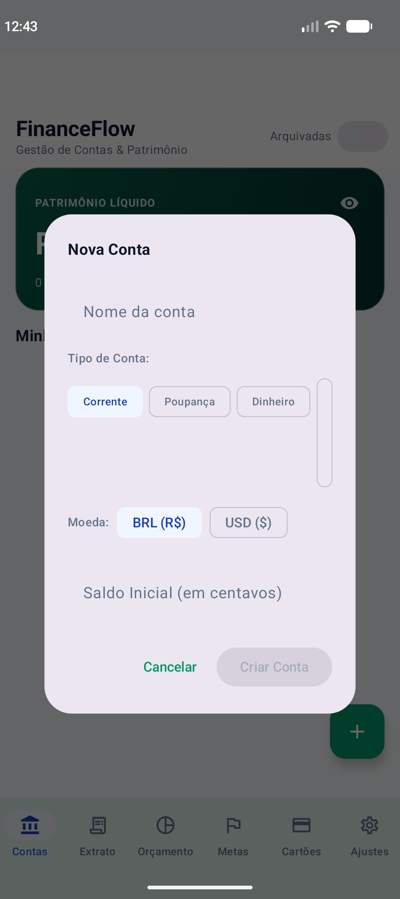
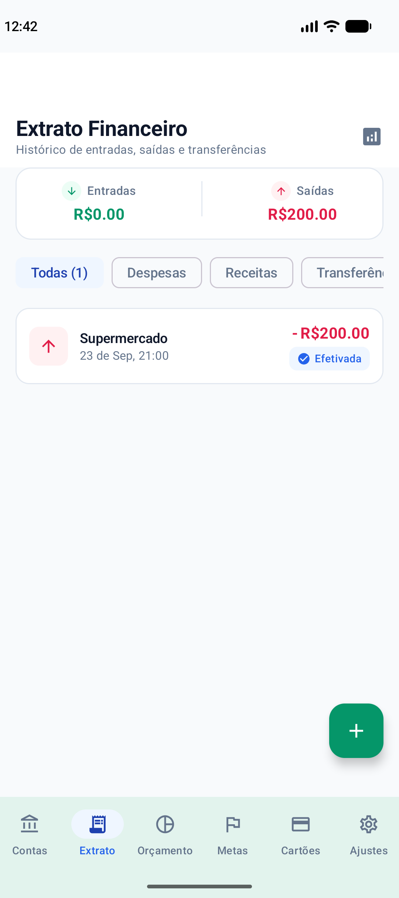
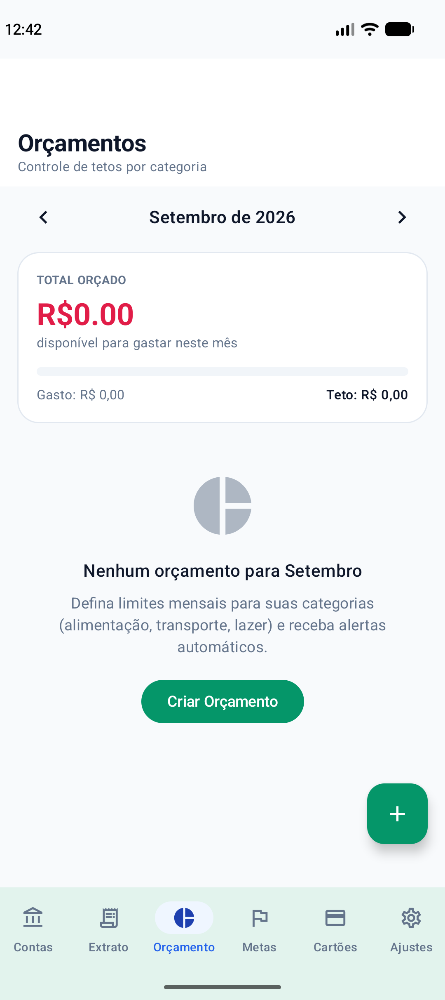
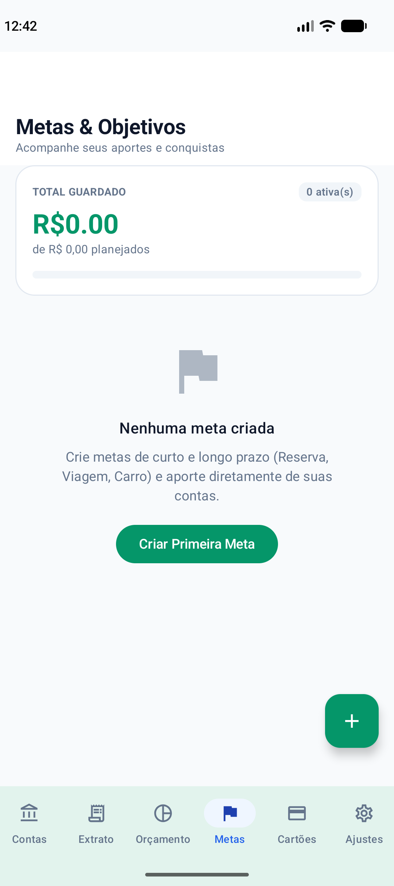
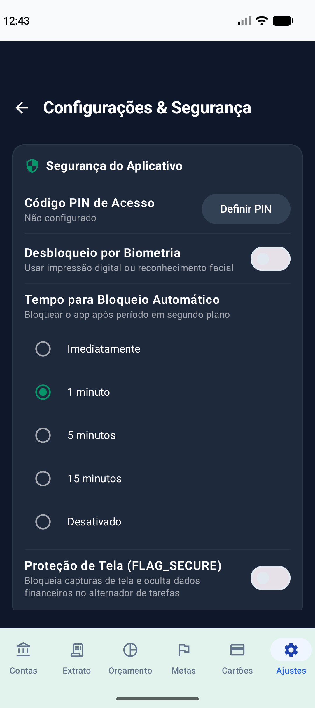

# FinanceFlow 💳📊

<p align="center">
  <strong>Native Android Finance Management for Individuals and Small Businesses</strong><br>
  <em>An Android portfolio project built with Kotlin, Jetpack Compose, local persistence, financial domain rules, and tests.</em>
</p>

<p align="center">
  
  
  
  
  
  
  
</p>

---

## 📱 Overview and Screenshots

**FinanceFlow** is a finance management app focused on monetary precision, privacy, and a smooth Android experience.

### Screen Gallery

<p align="center">
  
  
  
</p>
<p align="center">
  
  
  
</p>

---

## 🏛️ Architecture and Engineering Principles

The project draws on **Clean Architecture**, **DDD (Domain-Driven Design)**, and **UDF (Unidirectional Data Flow)** principles:

```text
┌────────────────────────────────────────────────────────────┐
│                     UI Layer (Compose)                     │
│  - Stateless composables, state hoisting, Material 3        │
│  - Navigation Compose with type-safe routes                │
│  - Paging 3 (LazyPagingItems) for transaction history       │
└─────────────────────────────┬──────────────────────────────┘
                              │ Sends events / observes state
┌─────────────────────────────▼──────────────────────────────┐
│                     Presentation Layer                     │
│  - ViewModels (@HiltViewModel)                             │
│  - StateFlow for UI state, Channels for one-time effects   │
└─────────────────────────────┬──────────────────────────────┘
                              │ Executes use cases
┌─────────────────────────────▼──────────────────────────────┐
│                        Domain Layer                        │
│  - Use cases for financial and privacy operations          │
│  - Immutable domain models in the core:model module        │
│  - Money value class with exact integer arithmetic         │
│  - Credit card, recurrence, and budget rules               │
└─────────────────────────────┬──────────────────────────────┘
                              │ Requests data
┌─────────────────────────────▼──────────────────────────────┐
│                         Data Layer                         │
│  - Repositories wired through Hilt                        │
│  - Room Database as the local source of truth              │
│  - Preferences DataStore for credentials and settings      │
│  - Audit history in audit_logs                             │
└────────────────────────────────────────────────────────────┘
```

---

## ⚖️ Business Rules and Financial Integrity

1. **Monetary Precision:**
   - Monetary amounts use integer minor units (`Long`) through `@JvmInline value class Money(val amountMinor: Long)` instead of floating-point storage.
   - Conversion from major units uses banker's rounding (`RoundingMode.HALF_EVEN`).
   - Operations across currencies require an explicit exchange rate and date rather than implicit conversion.

2. **Derived Account Balances:**
   - An account's available balance is derived from its initial balance and cleared or reconciled transactions. Pending transactions are excluded.
   - Accounts with transactions are archived rather than deleted. Archived accounts do not accept new entries.

3. **Atomic Transfers:**
   - A transfer creates a debit and a credit linked by the same `transferId`. Both entries and their audit events are persisted in a Room transaction.
   - Changes and deletion propagate atomically to the counterpart. Transfers require distinct accounts using the same currency.

4. **Credit Card Billing Cycles and Installments:**
   - Billing cycles use closing and due dates. Purchases after the closing date belong to the next billing cycle.
   - Installment purchases create linked entries (`installmentGroupId`), distributing remaining minor units without losing cents.

5. **Audit History:**
   - Account, category, and transaction mutations record audit events with UTC timestamps in `audit_logs`.
   - These mutations and their audit events share the same database transaction.

6. **Privacy and Data Controls:**
   - **Data export:** JSON export includes all database records and public security preferences without truncating audit history. Credentials and attachment files are excluded.
   - **Data deletion:** A persistent deletion intent allows cleanup to resume at startup after a failure. Room and DataStore do not share a transaction; default categories are recreated.
   - **Screen privacy:** Optional `FLAG_SECURE` protection blocks screenshots and hides financial data in the recent apps preview.
   - **App lock and biometrics:** Configurable background timeouts, biometric authentication through `BiometricPrompt`, and PIN verification using a salted `SHA-256` hash.

---

## 📑 Architecture Decision Records (ADRs)

The following ADRs document key architectural decisions:

| ADR | Title | Status |
|:---:|:---|:---:|
| [ADR-001](docs/adr/ADR-001-money-representation.md) | Integer Minor Units (`Long`) and the `Money` Value Class | Accepted |
| [ADR-002](docs/adr/ADR-002-offline-first-room.md) | Offline-First Architecture with Room as the Source of Truth | Accepted |
| [ADR-003](docs/adr/ADR-003-navigation-compose-type-safe.md) | Type-Safe Navigation Compose with Serializable Routes | Accepted |
| [ADR-004](docs/adr/ADR-004-dependency-injection-hilt.md) | Dependency Injection with Dagger Hilt | Accepted |
| [ADR-005](docs/adr/ADR-005-paging-3-scalability.md) | Reactive Transaction Pagination with AndroidX Paging 3 | Accepted |
| [ADR-006](docs/adr/ADR-006-mobile-security-and-lgpd.md) | Layered Security: Biometrics, Salted PIN, Screen Protection, and Privacy | Accepted |
| [ADR-007](docs/adr/ADR-007-data-integrity-and-recovery.md) | Data Integrity, Data-Preserving Migration, and Deletion Recovery | Accepted |

---

## 🛠️ Technology Stack

- **Language:** Kotlin 2.2.10
- **UI:** Jetpack Compose (BOM 2026.02.01), Material 3, Material Icons Extended
- **Navigation:** AndroidX Navigation Compose 2.8.7 with type-safe routes via `kotlinx.serialization`
- **Dependency injection:** Dagger Hilt 2.60.1 + KSP
- **Local database:** Room 2.7.2 + Room Paging
- **Pagination:** AndroidX Paging 3 (Paging Compose 3.3.6)
- **Preferences:** AndroidX DataStore Preferences 1.1.2
- **Security and biometrics:** AndroidX Biometric 1.2.0-alpha05, SHA-256 + salt
- **Splash screen:** AndroidX Core SplashScreen 1.0.1
- **Asynchronous programming:** Coroutines 1.9.0 + StateFlow / SharedFlow / Channels
- **Testing:** JUnit 4, Kotlinx Coroutines Test, Robolectric 4.14.1, CashApp Turbine 1.2.1

---

## 🧪 Tests

The test suite covers domain rules, ViewModels, database behavior, and transaction reconciliation.

```bash
# Run all unit tests
./gradlew test

# Build the debug APK
./gradlew assembleDebug
```

---

## 🚀 Getting Started

1. Clone the repository:

   ```bash
   git clone https://github.com/samuelbaldasso/Finance-Flow-App.git
   cd Finance-Flow-App
   ```

2. Open the project in **Android Studio** with support for the project's Android Gradle Plugin and JDK 21.
3. Wait for Gradle sync to complete.
4. Run the app on an emulator or physical device (`minSdk = 26`, `targetSdk = 36`).

---

## Validation and Database Evolution

The workflow in [`.github/workflows/android.yml`](.github/workflows/android.yml) runs unit tests, Android Lint, and a debug build for pull requests and pushes to `main` or `master`.

The database is at version 2. Migration 1 → 2 adds an account/status index while preserving existing records. Missing migrations fail explicitly; there is no destructive fallback. Exported schemas are stored in `app/schemas`.

To reproduce the validation steps locally:

```bash
./gradlew :core:model:test :app:testDebugUnitTest :app:lintDebug :app:assembleDebug
```

Regression tests cover rollback of financial operations and audit events, balances excluding pending transactions, migration with existing data, export of more than a thousand audit events, and deletion recovery after a failure.

### Current Limitations

The app stores data locally and does not provide remote synchronization. Export, app locking, and data deletion features do not constitute legal or security certification, including compliance with Brazil's LGPD data protection law. Exports preserve attachment references but do not bundle the files. Invoice management and recurrence still need further development for a complete production workflow.

---

## 👤 Author

**Samuel Baldasso**

- GitHub: [@samuelbaldasso](https://github.com/samuelbaldasso)
- Email: baldassosamuel93@gmail.com
